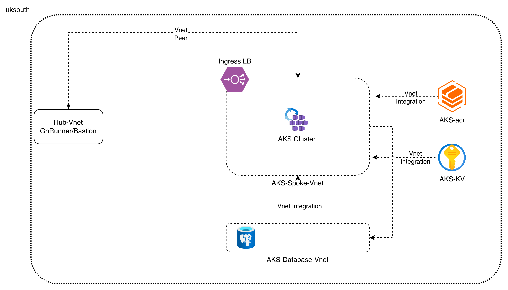

# Capstone Project  

The capstone project is a 3-tier application consisting of a Public Load balancer (tier-1), Frontend application(tier-2), a backend database(Postgres)(tier-3). We are going to host the application in kubernetes using Ingress L7 load balancer. We require TLS termination at Ingress layer and certificate management through cert-manager in k8s.

Database can be hosted as :-
1. K8s statefulset
2. Azure Postgres Flexible instance

## Arch diagram of Capstone project



## Pre-requisite - Infrastructure Deployment  
```
Execute the CICD Merge Workflow. This will setup the necessary roles, and Infrastructure resources required.
Do ensure that the necessary environment variables are setup in the Repo Settings > Environment > dev -
  AZURE_CLIENT_ID,
  AZURE_SUBSCRIPTION_ID,
  AZURE_TENANT_ID, 
  GH_RUNNER_URL, # Repo url. Copy from browser tab
  RUNNER_ADMIN_PAT, # create a PAT from Github settings > Developer Setting > Classic Token
  SSH_PUBLIC_KEY # contents of id_rsa.pub from your local terminal

Move to the next step once the workflow has executed successfully
```
## Pre-requisite - CertManager, Cluster Issuer, Ingress, ArgoCD, Helm  
```
Execute the helm deploy workflow that will setup the above requirements on your AKS cluster.
You can also unlock the commented out push methods so that it executes automatically after the 
successful execution of CICD Workflow and assign a DNS to argocd app based on the Ingress IP you get. For more
Information, see argocd readme
```
## Pre-requisite - Docker build & Push Auto-commit image sha digest
```
Execute the docker build workflow that will run the image deployment for your capstone project.
You can also unlock the commented out push methods so that it executes automatically after the 
successful execution of last workflow. Take reference from help deploy about the same
```
## Deployment Pipeline - Helm based GitOps  
```
Once the image deployment is setup, you can now copy the Application and deploy that by adding a new app
in argocd. Make sure to assign a DNS on the frontend app and you're good to go.
```