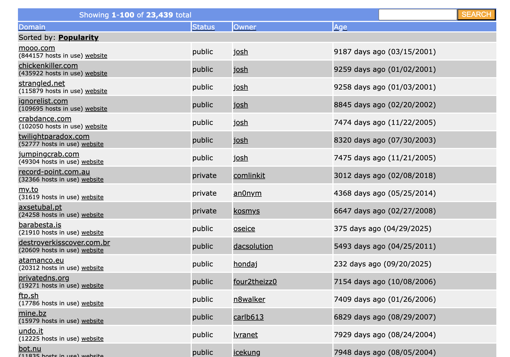
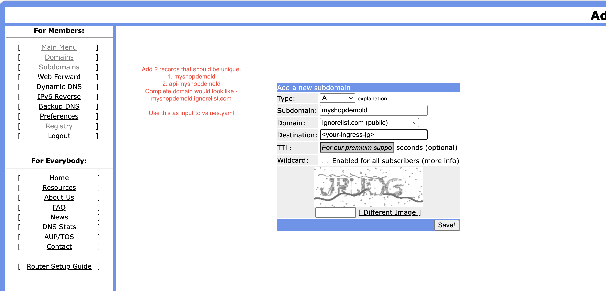
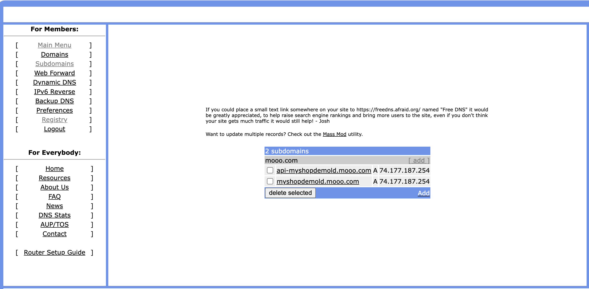

# Ingress setup and demo app
## Pre-requisites for Shop api app  

## Install NGINX Ingress Controller  
```
# Add NGINX repo
helm repo add ingress-nginx https://kubernetes.github.io/ingress-nginx
helm repo update

# Install (creates LoadBalancer)
helm install nginx-ingress ingress-nginx/ingress-nginx \
  --namespace ingress-nginx --create-namespace \
  --set controller.service.type=LoadBalancer \
  --set controller.service.annotations."service\.beta\.kubernetes\.io/azure-load-balancer-health-probe-request-path"="/healthz"
```
  
### Get external IP  
```
kubectl get svc -n ingress-nginx nginx-ingress-ingress-nginx-controller
# EXTERNAL-IP = your-load-balancer-ip
```

## Install Cert-Manager (Let’s Encrypt)
```
# Install cert-manager
helm repo add jetstack https://charts.jetstack.io
helm repo update

helm install cert-manager jetstack/cert-manager \
  --namespace cert-manager --create-namespace \
  --version v1.15.3 \
  --set installCRDs=true
```

### Let’s Encrypt ClusterIssuer
```
# letsencrypt-prod.yaml
apiVersion: cert-manager.io/v1
kind: ClusterIssuer
meta
  name: letsencrypt-prod
spec:
  acme:
    server: https://acme-v02.api.letsencrypt.org/directory
    email: your-email@example.com
    privateKeySecretRef:
      name: letsencrypt-prod
    solvers:
    - http01:
        ingress:
          class: nginx
---
apiVersion: cert-manager.io/v1
kind: ClusterIssuer
meta
  name: letsencrypt-staging
spec:
  acme:
    server: https://acme-staging-v02.api.letsencrypt.org/directory
    email: your-email@example.com
    privateKeySecretRef:
      name: letsencrypt-staging
    solvers:
    - http01:
        ingress:
          class: nginx
```
## Register a free sub-domain with freedns
```
1. Sign up with https://freedns.afraid.org/
2. Register a sub-domain with any publicly available domain like moo.com

4. Add A type DNS record as in the diagram


5. Wait for this DNS entry to propagate
6. Run command dig <DNS address> and look for the STATUS field. should be NOERROR
```

# Demo app  
```
Dir Structure
shop-demo/
├── Chart.yaml
├── values.yaml
├── values-dev.yaml
├── values-prod.yaml
└── templates/
    ├── _helpers.tpl
    ├── frontend-deployment.yaml
    ├── frontend-service.yaml
    ├── api-deployment.yaml
    ├── api-service.yaml
    ├── admin-deployment.yaml
    ├── admin-service.yaml
    └── ingress.yaml
```
## frontend-deployment.yaml  
```
# Frontend
apiVersion: apps/v1
kind: Deployment
meta
  name: frontend
  namespace: shop-demo
spec:
  replicas: 2
  selector:
    matchLabels:
      app: frontend
  template:
    meta
      labels:
        app: frontend
    spec:
      containers:
      - name: frontend
        image: nginx:alpine
        ports:
        - containerPort: 80
```
## frontend-service.yaml  
```
apiVersion: v1
kind: Service
meta
  name: frontend
  namespace: shop-demo
spec:
  selector:
    app: frontend
  ports:
  - port: 80
    targetPort: 80
```
  
## backend-api-deployment.yaml  
```
apiVersion: apps/v1
kind: Deployment
meta
  name: api
  namespace: shop-demo
spec:
  replicas: 2
  selector:
    matchLabels:
      app: api
  template:
    meta
      labels:
        app: api
    spec:
      containers:
      - name: api
        image: httpd:alpine
        ports:
        - containerPort: 80
```
## backend-api-service.yaml  
```
apiVersion: v1
kind: Service
meta
  name: api
  namespace: shop-demo
spec:
  selector:
    app: api
  ports:
  - port: 80
    targetPort: 80
```
  
## backend-admin-deployment.yaml
```
apiVersion: apps/v1
kind: Deployment
meta
  name: admin
  namespace: shop-demo
spec:
  replicas: 2
  selector:
    matchLabels:
      app: admin
  template:
    meta
      labels:
        app: admin
    spec:
      containers:
      - name: admin
        image: nginx:alpine
        ports:
        - containerPort: 80
``` 
## backend-admin-service.yaml
```
apiVersion: v1
kind: Service
meta
  name: admin
  namespace: shop-demo
spec:
  selector:
    app: admin
  ports:
  - port: 80
    targetPort: 80
```
## Common ingress
```
# host-routing.yaml
apiVersion: networking.k8s.io/v1
kind: Ingress
metadata:
  name: api-ingress
  namespace: shop-demo
  annotations:
    cert-manager.io/cluster-issuer: "letsencrypt-staging"
    nginx.ingress.kubernetes.io/ssl-redirect: "true"
spec:
  ingressClassName: nginx
  tls:
  - hosts:
    - api.shop.com
    secretName: shop-tls
  rules:
  - host: api.shop.com
    http:
      paths:
      - path: /
        pathType: Prefix
        backend:
          service:
            name: api
            port:
              number: 80
---
# path-routing.yaml
apiVersion: networking.k8s.io/v1
kind: Ingress
metadata:
  name: frontend-ingress
  namespace: shop-demo
  annotations:
    cert-manager.io/cluster-issuer: "letsencrypt-staging"
    nginx.ingress.kubernetes.io/ssl-redirect: "true"
spec:
  ingressClassName: nginx
  tls:
  - hosts:
    - shop.com
    secretName: shop-tls
  rules:
  - host: shop.com
    http:
      paths:
      - path: /
        pathType: Prefix
        backend:
          service:
            name: frontend
            port:
              number: 80
      - path: /admin
        pathType: Prefix
        backend:
          service:
            name: admin
            port:
              number: 80
---
```
# Verify Setup  

## Test Routing + TLS  
```
Edit  /etc/hosts  (Local Testing): 
<NGINX-IP> shop.com api.shop.com

Test L7 Routing: 
curl -k http://shop.demo.local     # Frontend (nginx welcome)
curl -k http://shop.demo.local/admin  # Admin (nginx welcome)  
curl -k http://api.shop.demo.local    # API (Apache welcome)

Verify TLS:
openssl s_client -connect shop.com:443 -servername shop.com
echo | openssl s_client -connect api.shop.com:443 -servername api.shop.com 2>/dev/null | openssl x509 -noout -subject

Verify Certificates:
kubectl get certificate -n shop-demo
kubectl get secret shop-tls -n shop-demo -o yaml
kubectl describe certificate shop-tls -n shop-demo

test redirect:
# 1. Get NGINX IP
INGRESS_IP=$(kubectl get svc -n ingress-nginx nginx-ingress-ingress-nginx-controller -o jsonpath='{.status.loadBalancer.ingress[0].ip}')

# 2. Edit /etc/hosts
echo "$INGRESS_IP shop.com" | sudo tee -a /etc/hosts

# 3. Test HTTP → HTTPS redirect
curl -I http://shop.demo.local
# HTTP/1.1 308 Permanent Redirect
# Location: http://shop.demo.local

# 4. Test HTTPS works
curl -k https://api-aksingressdemo.duckdns.org

```
  
# Setup Summary  
```
1. Install NGINX Ingress → LoadBalancer IP
2. Deploy 3 apps → Services ready
3. Host-based Ingress → api.shop.com
4. Path-based Ingress → shop.com + /admin
5. Cert-Manager → Auto TLS certs
6. Test with curl + /etc/hosts
7. Verify cert-manager events
```

# Helm cheat sheet for this exercise
```
helm create shop-demo # No need to do this when you already have the dir structure
helm lint shop-demo
helm template demo-release shop-demo -f shop-demo/values-dev.yaml
helm install demo-release ./shop-demo -n demo --create-namespace -f shop-demo/values-dev.yaml
helm upgrade demo-release ./shop-demo -n demo -f shop-demo/values-prod.yaml
helm package shop-demo # create package release for distribution
helm uninstall demo-release -n demo
```

## Expected outputs
```
piyushsharma@Piyushs-MacBook-Air shop-api % curl -v -L http://myshopdemold.mooo.com
* Host myshopdemold.mooo.com:80 was resolved.
* IPv6: (none)
* IPv4: 74.177.187.254
*   Trying 74.177.187.254:80...
* Connected to myshopdemold.mooo.com (74.177.187.254) port 80
> GET / HTTP/1.1
> Host: myshopdemold.mooo.com
> User-Agent: curl/8.7.1
> Accept: */*
> 
* Request completely sent off
< HTTP/1.1 308 Permanent Redirect
< Date: Sun, 10 May 2026 18:29:21 GMT
< Content-Type: text/html
< Content-Length: 164
< Connection: keep-alive
< Location: https://myshopdemold.mooo.com
< 
* Ignoring the response-body
* Connection #0 to host myshopdemold.mooo.com left intact
* Clear auth, redirects to port from 80 to 443
* Issue another request to this URL: 'https://myshopdemold.mooo.com/'
* Host myshopdemold.mooo.com:443 was resolved.
* IPv6: (none)
* IPv4: 74.177.187.254
*   Trying 74.177.187.254:443...
* Connected to myshopdemold.mooo.com (74.177.187.254) port 443
* ALPN: curl offers h2,http/1.1
* (304) (OUT), TLS handshake, Client hello (1):
*  CAfile: /etc/ssl/cert.pem
*  CApath: none
* (304) (IN), TLS handshake, Server hello (2):
* (304) (IN), TLS handshake, Unknown (8):
* (304) (IN), TLS handshake, Certificate (11):
* (304) (IN), TLS handshake, CERT verify (15):
* (304) (IN), TLS handshake, Finished (20):
* (304) (OUT), TLS handshake, Finished (20):
* SSL connection using TLSv1.3 / AEAD-AES256-GCM-SHA384 / [blank] / UNDEF
* ALPN: server accepted h2
* Server certificate:
*  subject: CN=myshopdemold.mooo.com
*  start date: May 10 17:28:59 2026 GMT
*  expire date: Aug  8 17:28:58 2026 GMT
*  subjectAltName: host "myshopdemold.mooo.com" matched cert's "myshopdemold.mooo.com"
*  issuer: C=US; O=Let's Encrypt; CN=R13
*  SSL certificate verify ok.
* using HTTP/2
* [HTTP/2] [1] OPENED stream for https://myshopdemold.mooo.com/
* [HTTP/2] [1] [:method: GET]
* [HTTP/2] [1] [:scheme: https]
* [HTTP/2] [1] [:authority: myshopdemold.mooo.com]
* [HTTP/2] [1] [:path: /]
* [HTTP/2] [1] [user-agent: curl/8.7.1]
* [HTTP/2] [1] [accept: */*]
> GET / HTTP/2
> Host: myshopdemold.mooo.com
> User-Agent: curl/8.7.1
> Accept: */*
> 
* Request completely sent off
< HTTP/2 200 
< date: Sun, 10 May 2026 18:29:22 GMT
< content-type: text/html
< content-length: 896
< last-modified: Tue, 07 Apr 2026 12:09:54 GMT
< etag: "69d4f412-380"
< accept-ranges: bytes
< strict-transport-security: max-age=31536000; includeSubDomains
< 
<!DOCTYPE html>
<html>
<head>
<title>Welcome to nginx!</title>
<style>
html { color-scheme: light dark; }
body { width: 35em; margin: 0 auto;
font-family: Tahoma, Verdana, Arial, sans-serif; }
</style>
</head>
<body>
<h1>Welcome to nginx!</h1>
<p>If you see this page, nginx is successfully installed and working.
Further configuration is required for the web server, reverse proxy, 
API gateway, load balancer, content cache, or other features.</p>

<p>For online documentation and support please refer to
<a href="https://nginx.org/">nginx.org</a>.<br/>
To engage with the community please visit
<a href="https://community.nginx.org/">community.nginx.org</a>.<br/>
For enterprise grade support, professional services, additional 
security features and capabilities please refer to
<a href="https://f5.com/nginx">f5.com/nginx</a>.</p>

<p><em>Thank you for using nginx.</em></p>
</body>
</html>
* Connection #1 to host myshopdemold.mooo.com left intact

piyushsharma@Piyushs-MacBook-Air shop-api % curl -v -L https://myshopdemold.mooo.com
* Host myshopdemold.mooo.com:443 was resolved.
* IPv6: (none)
* IPv4: 74.177.187.254
*   Trying 74.177.187.254:443...
* Connected to myshopdemold.mooo.com (74.177.187.254) port 443
* ALPN: curl offers h2,http/1.1
* (304) (OUT), TLS handshake, Client hello (1):
*  CAfile: /etc/ssl/cert.pem
*  CApath: none
* (304) (IN), TLS handshake, Server hello (2):
* (304) (IN), TLS handshake, Unknown (8):
* (304) (IN), TLS handshake, Certificate (11):
* (304) (IN), TLS handshake, CERT verify (15):
* (304) (IN), TLS handshake, Finished (20):
* (304) (OUT), TLS handshake, Finished (20):
* SSL connection using TLSv1.3 / AEAD-AES256-GCM-SHA384 / [blank] / UNDEF
* ALPN: server accepted h2
* Server certificate:
*  subject: CN=myshopdemold.mooo.com
*  start date: May 10 17:28:59 2026 GMT
*  expire date: Aug  8 17:28:58 2026 GMT
*  subjectAltName: host "myshopdemold.mooo.com" matched cert's "myshopdemold.mooo.com"
*  issuer: C=US; O=Let's Encrypt; CN=R13
*  SSL certificate verify ok.
* using HTTP/2
* [HTTP/2] [1] OPENED stream for https://myshopdemold.mooo.com/
* [HTTP/2] [1] [:method: GET]
* [HTTP/2] [1] [:scheme: https]
* [HTTP/2] [1] [:authority: myshopdemold.mooo.com]
* [HTTP/2] [1] [:path: /]
* [HTTP/2] [1] [user-agent: curl/8.7.1]
* [HTTP/2] [1] [accept: */*]
> GET / HTTP/2
> Host: myshopdemold.mooo.com
> User-Agent: curl/8.7.1
> Accept: */*
> 
* Request completely sent off
< HTTP/2 200 
< date: Sun, 10 May 2026 18:34:29 GMT
< content-type: text/html
< content-length: 896
< last-modified: Tue, 07 Apr 2026 12:09:54 GMT
< etag: "69d4f412-380"
< accept-ranges: bytes
< strict-transport-security: max-age=31536000; includeSubDomains
< 
<!DOCTYPE html>
<html>
<head>
<title>Welcome to nginx!</title>
<style>
html { color-scheme: light dark; }
body { width: 35em; margin: 0 auto;
font-family: Tahoma, Verdana, Arial, sans-serif; }
</style>
</head>
<body>
<h1>Welcome to nginx!</h1>
<p>If you see this page, nginx is successfully installed and working.
Further configuration is required for the web server, reverse proxy, 
API gateway, load balancer, content cache, or other features.</p>

<p>For online documentation and support please refer to
<a href="https://nginx.org/">nginx.org</a>.<br/>
To engage with the community please visit
<a href="https://community.nginx.org/">community.nginx.org</a>.<br/>
For enterprise grade support, professional services, additional 
security features and capabilities please refer to
<a href="https://f5.com/nginx">f5.com/nginx</a>.</p>

<p><em>Thank you for using nginx.</em></p>
</body>
</html>
* Connection #0 to host myshopdemold.mooo.com left intact
piyushsharma@Piyushs-MacBook-Air shop-api % 

piyushsharma@Piyushs-MacBook-Air shop-api % curl -v -L https://api-myshopdemold.mooo.com/admin
* Host api-myshopdemold.mooo.com:443 was resolved.
* IPv6: (none)
* IPv4: 74.177.187.254
*   Trying 74.177.187.254:443...
* Connected to api-myshopdemold.mooo.com (74.177.187.254) port 443
* ALPN: curl offers h2,http/1.1
* (304) (OUT), TLS handshake, Client hello (1):
*  CAfile: /etc/ssl/cert.pem
*  CApath: none
* (304) (IN), TLS handshake, Server hello (2):
* (304) (IN), TLS handshake, Unknown (8):
* (304) (IN), TLS handshake, Certificate (11):
* (304) (IN), TLS handshake, CERT verify (15):
* (304) (IN), TLS handshake, Finished (20):
* (304) (OUT), TLS handshake, Finished (20):
* SSL connection using TLSv1.3 / AEAD-AES256-GCM-SHA384 / [blank] / UNDEF
* ALPN: server accepted h2
* Server certificate:
*  subject: CN=api-myshopdemold.mooo.com
*  start date: May 10 17:24:00 2026 GMT
*  expire date: Aug  8 17:23:59 2026 GMT
*  subjectAltName: host "api-myshopdemold.mooo.com" matched cert's "api-myshopdemold.mooo.com"
*  issuer: C=US; O=Let's Encrypt; CN=R12
*  SSL certificate verify ok.
* using HTTP/2
* [HTTP/2] [1] OPENED stream for https://api-myshopdemold.mooo.com/admin
* [HTTP/2] [1] [:method: GET]
* [HTTP/2] [1] [:scheme: https]
* [HTTP/2] [1] [:authority: api-myshopdemold.mooo.com]
* [HTTP/2] [1] [:path: /admin]
* [HTTP/2] [1] [user-agent: curl/8.7.1]
* [HTTP/2] [1] [accept: */*]
> GET /admin HTTP/2
> Host: api-myshopdemold.mooo.com
> User-Agent: curl/8.7.1
> Accept: */*
> 
* Request completely sent off
< HTTP/2 404 
< date: Sun, 10 May 2026 18:36:17 GMT
< content-type: text/html; charset=iso-8859-1
< content-length: 236
< strict-transport-security: max-age=31536000; includeSubDomains
< 
<!DOCTYPE HTML PUBLIC "-//W3C//DTD HTML 4.01//EN" "http://www.w3.org/TR/html4/strict.dtd">
<html><head>
<title>404 Not Found</title>
</head><body>
<h1>Not Found</h1>
<p>The requested URL was not found on this server.</p>
</body></html>
* Connection #0 to host api-myshopdemold.mooo.com left intact

```